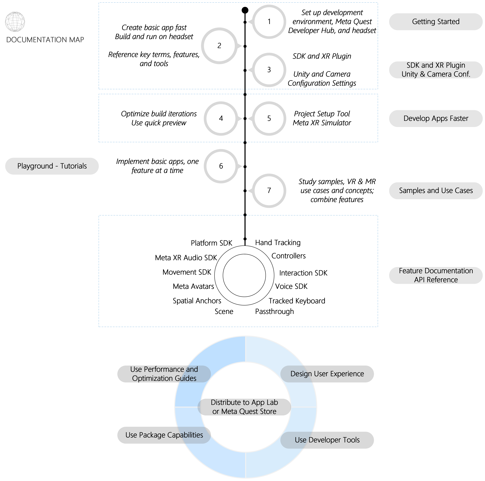

# Unity and VR Development Process


## Meta Quest3
   ### Meta Account Registration

   - Register at [Meta Auth](https://auth.meta.com/)

   
   
   ### [Enable Developer Mode](https://developer.oculus.com/documentation/unity/book-unity-gsg/) 


Once you belong to a developer organization, follow these steps to put your device in developer mode:

1. Open the Meta Quest mobile app, go to Menu > Devices. Select your headset to access Headset Settings and turn on Developer Mode.
2. Connect the headset to the computer using a USB-C cable and put on the headset again. Go to Settings > System > Developer, and turn on Enable custom settings and MTP Notification.
3. Click Always allow from this computer when prompted to allow USB debugging.
4. Connect your headset to the computer using a USB-C cable and wear the headset.
5. Accept Allow USB Debugging and Always allow from this computer when prompted on the headset.

For more detailed instructions, visit the [Meta Quest Developer Mode Setup Guide](https://developer.oculus.com/documentation/native/android/mobile-device-setup/#enable-developer-mode).


Download Oculus ADB Drivers [link](https://developer.oculus.com/downloads/package/oculus-adb-drivers/)

Use ADB with Meta Quest [ADB](https://developer.oculus.com/documentation/native/android/ts-adb/#mobile-android-debug-intro)


---

   ### Meta Quest Developer Hub for Windows

   - Download from [Meta Quest Developer Hub](https://developer.oculus.com/downloads/package/oculus-developer-hub-win/)
   - This is a platform for developers to create, test, and release virtual reality (VR) applications and games for the Meta Quest (formerly known as Oculus Quest) headset.
   - The platform provides a range of tools and resources to help developers develop and optimize their applications on the Meta Quest VR system.
   
   ### Meta Quest Developer Hub

   Meta Quest Developer Hub (MQDH) is a development app that helps you develop apps for the Meta Quest line of headsets. With it you can:

   - Use either a cable or WIFI connection between your headset and the computer
   - Disable the proximity sensor and Boundary (Guardian) for an uninterrupted testing workflow
   - View the device logs to help with debugging
   - Capture screenshots and record videos of what you see in the headset (see Record a Video for more information.)
   - Deploy apps directly to your headset from your computer
   - Upload apps to the Meta Quest Developer Dashboard for store distribution
   - Share your VR experience by casting the headset display to the computer
   - Download the latest Meta Quest tools and SDKs you need to build apps

   Meta Quest Link is a feature of Meta Quest headsets that turn them into PC VR headsets. With this feature, you can connect your development PC via to the headset via cable or airlink over WiFi. When connected, you can debug your app running on your headset from within your development environment.

   #### Prerequisites

   Setting up MQDH with the Meta Quest headset is quick and easy. It’s a cross-platform desktop tool, that runs on the macOS and Windows operating systems. Before you begin the setup process, get your Meta Quest headset and a USB-C cable.

   #### Install MQDH

   1.  Meta Quest LinkDownload

         - Download from [Meta Quest Link](https://www.oculus.com/download_app/?id=1582076955407037)
         - This software is convenient for using Quest link for streaming development.
   2. Open the application and log in using your developer credentials, which must be the same as you’ve used for logging in the headset.
      - Note: As of January 1st, 2023, you must use a Meta account to log in to MQDH, apps, and Meta headsets. For more information, read the Introducing Meta Accounts: What Developers Need to Know blog post.

   #### Connect Headset to MQDH

   To use MQDH features, you need to connect a Meta Quest headset to the computer.

   1. Open the Meta Horizon mobile app, go to Menu > Devices. Select your headset to access Headset Settings and turn on Developer Mode. See Set Up Development Environment and Headset for information on the Meta Quest mobile app.
   2. Connect the headset to the computer using a USB-C cable and put on the headset again. Go to Settings > System > Developer, and turn on Enable custom settings and MTP Notification.
   3. Click Always allow from this computer when prompted to allow USB debugging.

   4. Connect your headset to the computer using a USB-C cable and wear the headset.
   5. Accept Allow USB Debugging and Always allow from this computer when prompted on the headset.

   6. Open MQDH.
   7. On the MQDH navigation pane, choose Device Manager. All the devices you have set up are displayed in the main pane. Each device is shown with its status, which includes the device ID and connection status. The active device shows the green Active designator.
   8. If there are multiple headsets connected to your computer, you can use the drop-down menu in the upper-right corner to select the headset currently connected to MQDH.

   #### Set Up Headset from MQDH

   You can use MQDH to set up a new Meta Quest headset and do a factory reset.

   1. Make sure that the headset is charged and turned on.
   2. Bluetooth must be enabled on your computer.
   3. Open MQDH.
   4. On the navigation pane, choose Device Manager. Then from the upper-right corner of the main pane, click Set Up New Device. If you already have the headset set up in MQDH, the headset is available in the list located in the upper-right corner of MQDH.
   5. Read the guidance and click Next.
   6. Select the type of headset.
   7. After MQDH has discovered the headset, click the headset ID, and then click Next.
   8. Log in using your developer credentials.
   9. In the WiFi window, select the WiFi network you want to use. This should be the same network as your development computer to enable casting headset on your computer.
   10. On the Complete Setup from Your Headset window, put on the headset, and then follow the prompts.
   11. After the headset reboots and MQDH reconnects to it, use the slider to turn on the developer mode. Your developer account must be verified to turn on the developer mode.
   12. The final screen tells you how to enable the headset to use MQDH features. You must:
      - Connect the headset to the computer via USB.
      - Allow access when prompted in the headset.
   13. To set up multiple headsets, repeat the steps to connect other headsets.

   #### Enable Android Developer Bridge (ADB) over WiFi

   ADB is a command-line tool bundled with MQDH which enables you to communicate with your Meta Quest headset during development. With MQDH, you can connect the headset wirelessly to the computer using ADB over WiFi.

   1. After you’ve connected the headset to MQDH over a USB-C cable, on MQDH Device Manager, on Device Actions, turn on ADB over Wi-Fi.
   2. The status under ADB over WiFi changes to enabled.
   3. Disconnect the USB cable from the headset to continue using your headset wirelessly.

   For more information on ADB, see Use ADB with Meta Headsets.

   - Note: ADB is a utility that is part of the Android SDK and is also part of the MQDH install. If you have previously installed the Android SDK, you may have a different ADB version already running on your computer. The different ADB instances can conflict with each other, giving you unexpected results.
   - When MQDH does detect adb paths on startup, it displays a warning message. If the warning message appears when you start MQDH, you can use the existing ADB version installed on your computer by changing the ADB path in MQDH.

   ##### To change the ADB path in MQDH

   1. On the navigation pane, click Settings.
   2. Modify the ADB path to let MQDH use the ADB instance located on your computer.

   #### Turn off Proximity Sensor and Boundary

   For development and debugging purposes, you can turn off the proximity sensor and Boundary (Guardian). However, we strongly recommend to turn them on when the device is no longer in development mode.

   - The proximity sensor is enabled to ensure that the headset goes to sleep when not in use.
   - Boundary creates a virtual boundary to ensure your safety when you’re immersed in the VR experience.
   - During development, you often debug directly in the dev environment without wearing the headset, so it’s safe to turn off these features. Turning them off makes it easy to capture screenshots, record videos, and step through code.

   - Note: Turning off the proximity sensor means your device will not go to sleep, so your battery won’t last as long. We highly recommend that you either turn the headset off, leave the device charging, or turn the proximity sensor back on when you don’t need it to be off.

   1. On the MQDH Device Manager, under Device Actions, turn off Proximity Sensor and Guardian to keep the headset in the active state. You can also press the CTRL + Shift + P and CTRL + Shift + G keyboard shortcuts to turn on or off the proximity sensor and Boundary, respectively.

   #### Change the Device Name

   With MQDH, you can give your devices nicknames and make them easier to identify.

   1. On the MQDH Device Manager, under Settings, click Change.
   2. In the Device Nickname dialog, enter a new nickname for the device that’s currently connected with MQDH.
   3. Click Save.

   #### Set Up Meta Quest Link

   MQDH offers the options to configure the Meta Quest Link. From the MQDH Device Manager, you can do the following:

   - Enable and disable Link mode
   - Switch between Cable and Air Link

   Link mode causes the device to behave like a PC VR headset until the mode is explicitly turned off.

   ##### To switch between Air Link and Cable modes:

   1. On the navigation pane, choose Device Manager.
   2. In the Device Actions pane, click the Select Mode dropdown and choose between Air Link and Cable. This sets the mode for the Active headset.

   #### Video and Image Files

   You can use the MQDH dashboard to capture images and screen recordings. To find them after you have recorded them, in the navigation pane, click the File Manager tab. When you open the MQDH File Manager and click on Videos or Images all the media of that type is synchronized from the device to the PC desktop. This synchronization is not continuous, so you need to open the MQDH File Manager and click on Videos or Images whenever you want do download new content.

   - Note: Video files will not be automatically downloaded from MQDH. You will need to open the file in order to download it.

   #### MQDH Settings

   To view and update MQDH settings, open MQDH. Then, in the navigation pane, select Settings. You’ll find three tabs:

   - General, for general settings, including ADB Path, Download Large Device Files, and more.
   - About tab, which provide various information, such as MQDH Version, and Terms of Service.
   - Notifications, where you can adjust your notification settings.

   #### Updates

   MQDH maintains a regular update cadence to ship new features and important bug fixes. It supports auto-update and you will be prompted to install the new release when it becomes available.


      

   
## Development Progress

### Initial Setup

1. **Meta Account Registration**
   - Successfully registered a Meta account in [Meta Auth](https://auth.meta.com/).

2. **Oculus PC App Download**
   - Downloaded the Oculus PC App from [Oculus PC App](https://www.oculus.com/download_app/?id=1582076955407037).
   - Installed and configured the app for streaming development.

3. **Meta Quest Developer Hub Installation**
   - Downloaded and installed the Meta Quest Developer Hub from [Meta Quest Developer Hub](https://developer.oculus.com/downloads/package/oculus-developer-hub-win/).
   - The hub provides essential tools for VR application development and optimization.

   
### Enabling Developer Mode

- meta account 

  - Tips:  The developer Mode is only for the ***acoount*** which is the **owner** of the quest3


      1. Opened the Meta Quest mobile app, navigated to `Menu > Devices`, and selected the `headset` to access Headset Settings and turn on `Developer Mode`.
      2. Connected the headset to the computer using a *USB-C cable* and put on the headset again. Went to `Settings > System > Developer`, and turned on Enable custom settings and MTP Notification.
      3. Clicked `Always allow from this computer` when prompted to allow USB debugging.
      4. Connected the headset to the computer using a *USB-C cable* and wore the headset.
      5. Accepted Allow USB Debugging and Always allow from this computer when prompted on the headset.

- Configured the development environment and created necessary apps via ["MY APPS"](https://developer.oculus.com/manage/).


## Unity Integration

### UnityHub Download

- Download from [UnityHub](https://unity.com/cn/download)


### Unity Sample
- download UnityStartSample
  - This sample project can be downloaded from GitHub: [Unity-StarterSamples](https://github.com/oculus-samples/Unity-StarterSamples)

   - The starter samples you will find here are to help you navigate and understand our APIs with more flexibility. We encourage you to look into them, test them out and inspire yourself on how the APIs can be used in your own project.

   The [Oculus License](./LICENSE) applies to the samples.

   This project was built using the [Unity engine](https://unity.com/download).

   ### Getting The Code
   Clone this repo using the "Code" button above, or this command:
   ```sh
   git clone https://github.com/oculus-samples/Unity-StarterSamples.git
   ```

   ### How to run the project in Unity
   1. Make sure you're using  *Unity 2021.3.26f1* or newer.
   2. In the Project window, navigate to [Assets/StarterSamples/Usage](Unity-StarterSamples/Assets/StarterSamples/Usage).
   3. Click on individual scenes.
   4. Click **Play** button to explore scene functionality in Unity.

   ### How to test on device
   1. Navigate to **Oculus** > **Samples** > **Build Starter Scene** to build an APK that will launch the **Starter Scene**.
      <div style="margin-left: 4.5em;"></div>
      * In this apk you will be able to cycle through the different sample scenes to test them out on device.
   2. Navigate to the `Unity-StarterSamples` folder and copy the `StartScene.apk` to your device using [Meta Quest Developer Hub](https://developer.oculus.com/documentation/unity/ts-odh-deploy-build/).

   ### SDK Dependencies
   All Meta SDKs can be found in the [Unity Asset Store](https://assetstore.unity.com/publishers/25353).
   This project depends on SDKs defined in the [Packages/manifest.json](./Packages/manifest.json):
   * [Meta XR Core SDK](https://assetstore.unity.com/packages/tools/integration/meta-xr-core-sdk-269169)
   * [Meta XR Platform SDK](https://assetstore.unity.com/packages/tools/integration/meta-xr-platform-sdk-262366)

   ### Integrate Samples to your own project
   1. Make sure your project uses the same SDK version
   2. Move the samples to your project

      #### <summary><b>Copy Samples directory</b></summary>

      Copy [Assets/StarterSamples](./Unity-StarterSamples/Assets/StarterSamples) 
      #### <summary><b>Create UnityPackage and Import it</b></summary>

   1. Open Unity-StarterSamples project in Unity
   2. Right-click on [Assets/StarterSamples](./Unity-StarterSamples/Assets/StarterSamples) and select <i>`Export Package`...</i>
   3. Save package in an easy location to retrieve
   4. Open your own project (where you want the samples to be added)
   5. Click on `Assets->Import Package->Custom Package...`from the menu bar
   6. Find the package we saved in step 3 and click <i>`Open`</i>


